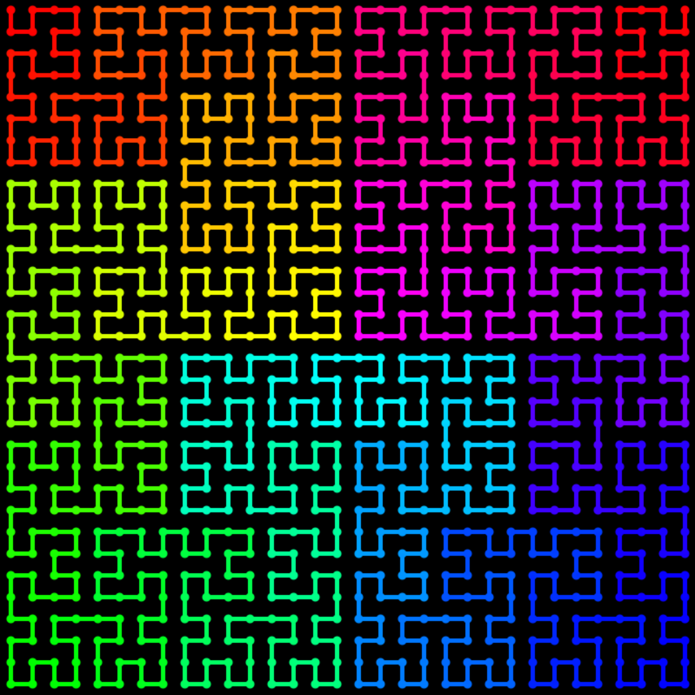

# One file JS program that draws Hilbert curve iteratively

Clone this repository and open `index.html` to run the program.



Program uses this function to draw Hilbert curve in iterative way:
```js

/* N - size of hilbert curve,
 * N must be power of 2;
 *
 * hindex - number between 0..(N*N-1)
 *
 * returns coords [x, y] of hindex'th point of the curve
 */
function hindex2xy(hindex, N) {
    var positions = [
    /* 0: */ [0, 0],
    /* 1: */ [0, 1],
    /* 2: */ [1, 1],
    /* 3: */ [1, 0]
    ];

    var tmp = positions[last2bits(hindex)];
    hindex = (hindex >>> 2);

    var x = tmp[0];
    var y = tmp[1];

    for (var n = 4; n <= N; n *= 2) {
        var n2 = n / 2;

        switch (last2bits(hindex)) {
        case 0: /* left-bottom */
            tmp = x; x = y; y = tmp;
            break;

        case 1: /* left-upper */
            x = x;
            y = y + n2;
            break;

        case 2: /* right-upper */
            x = x + n2;
            y = y + n2;
            break;

        case 3: /* right-bottom */
            tmp = y;
            y = (n2-1) - x;
            x = (n2-1) - tmp;
            x = x + n2;
            break;
        }

        hindex = (hindex >>> 2);
    }

    return [x, y];

    function last2bits(x) { return (x & 3); }
}
```